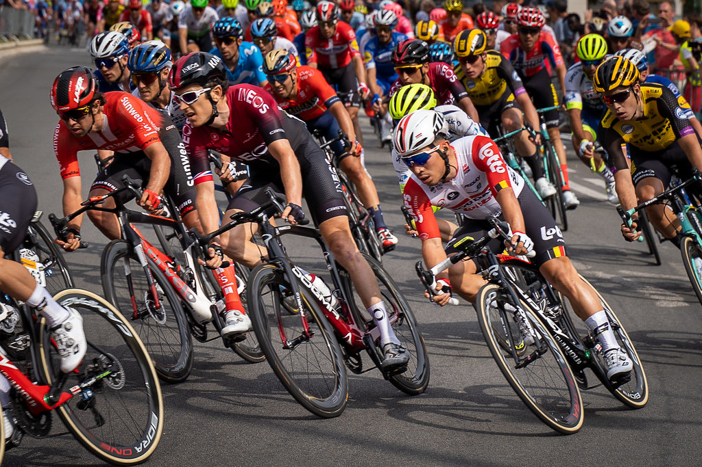

# Grand Tour Cycling Portal Backend

 

> Development has ended

This code was jointly developed by Adam Kaizra and Sam Barker for the continuous assessment of the first year module Object-Orientated Programming taught by Prof. Diogo Pacheco.

The coursework was designed to simulate a working environment where the front-end was supplied by a separate contractor (in this case the Professor) at a later date, and we were to provide a backend to the cycling portal. It was loosely based of off a grand tour where we had to manage riders and their teams, race types and race results.

We developed this code using pair programming, which is documented in the `development_log.txt`, so ignore the git contributers as in most cases it was a joint effort.

## Prerequisites

The program was written in Java 8 and includes a compiled jar file of the program as referenced in the `specification.pdf` file.

## Usage

Without the front-end there is not much usuage in the program and I wouldn't advise making one as the specification does not strictly adhere to the rules of grand tours.

## License

[MIT](https://choosealicense.com/licenses/mit/)
